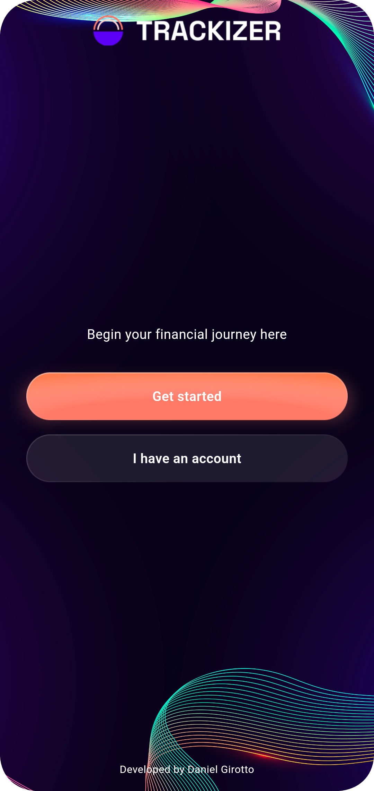
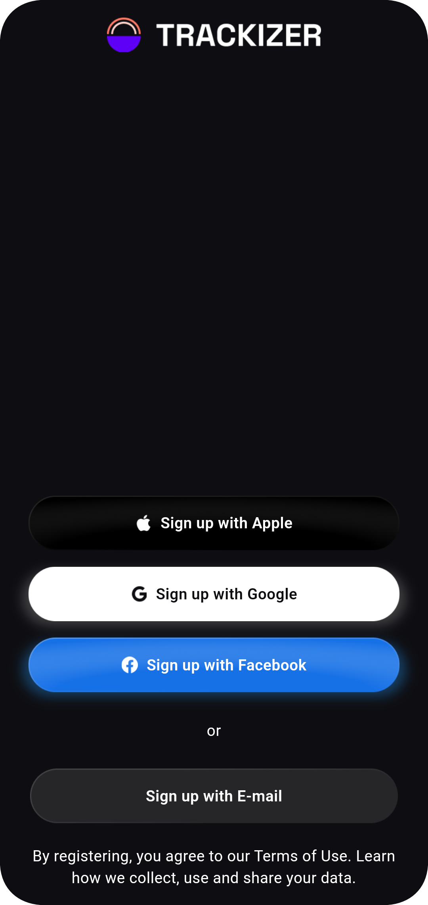
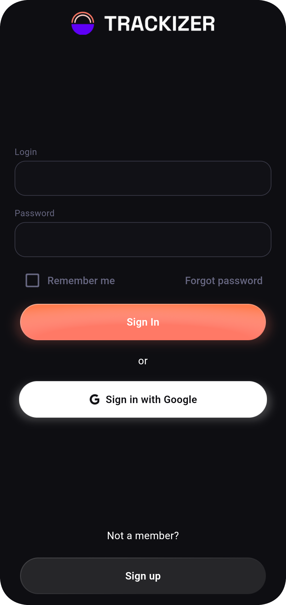
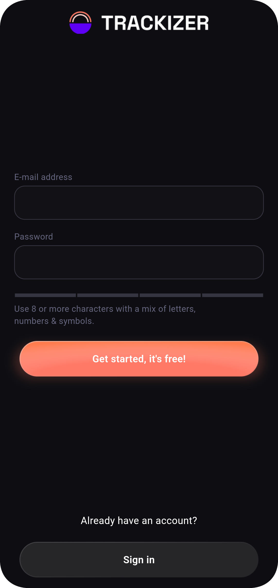
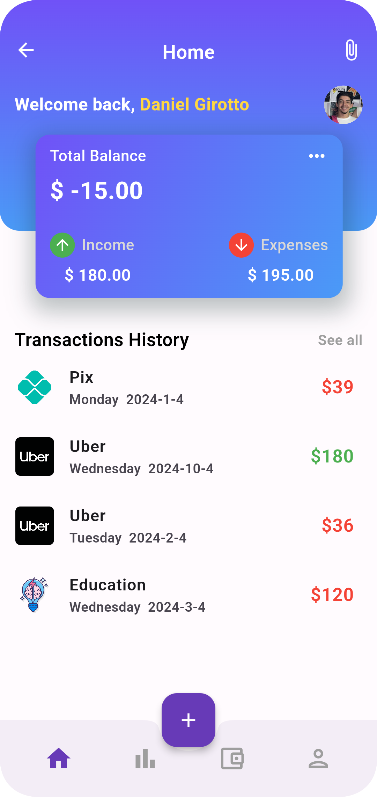
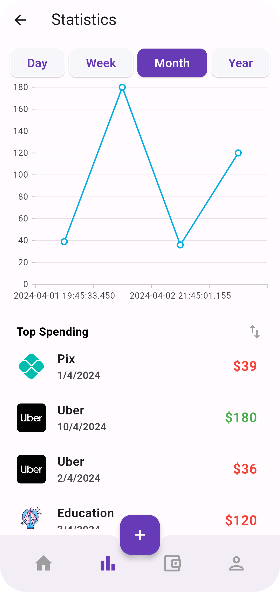
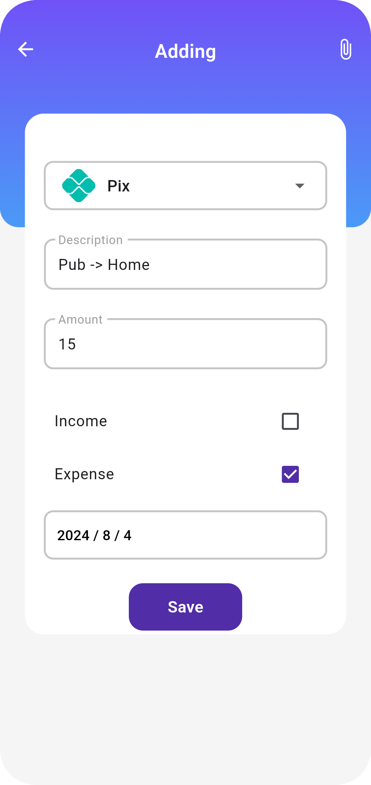

# Financial Management App

## Table of Contents

- [Overview](#overview)
- [Features](#-features)
- [How to Use](#-how-to-use)
- [Installation](#-installation)
- [Dependencies](#-dependencies)
- [Screenshots](#-screenshots)
- [To-Do List](#-to-do-list)
- [Contributing](#contributing)

## Overview

The Financial Management App is a comprehensive tool designed to assist users in managing their finances efficiently. With a sleek UI, intuitive navigation, and robust features, it provides users with a seamless experience for tracking expenses and analyzing spending patterns.

## 📌 Features

- **Expense Tracking**: Easily add, edit, and categorize expenses to keep track of spending.
- **Modern and Clear Graphs**: View visually appealing and easily understandable graphs to analyze spending habits and financial trends.
- **Swipe to Delete**: Utilize the swipe-to-delete function to remove unwanted transactions quickly.
- **Google Sign-In**: Seamlessly sign in with Google using Firebase authentication. Upon signing in, the app retrieves your name and profile picture, which you can view on the home page.

## 🔍 How to Use

1. **Sign In or Sign Up**: Use the provided options to sign in to an existing account or sign up for a new one.
2. **Add Expenses**: Navigate to the add page to input details of your expenses, including amount, category, and date.
3. **Track Spending**: Access the home page to view a summary of your finances, including total expenses and available balance.
4. **Analyze Data**: Visit the statistics page to visualize your spending patterns through modern and clear graphs.
5. **Manage Transactions**: Utilize the swipe-to-delete feature to remove unwanted transactions effortlessly.

## 📌 Installation

```bash
git clone https://github.com/dgirotto0/finance_app.git
cd finance_app
flutter run
```

## 📌 Dependencies

```yaml
dependencies:
  cupertino_icons: ^1.0.6
  dotted_border: ^2.0.0+3
  intl: ^0.19.0
  google_sign_in: ^6.1.5
  firebase_core: ^2.9.0
  firebase_auth: ^4.4.0
  syncfusion_flutter_charts: ^25.1.37
  hive: ^2.2.3
  hive_flutter: ^1.1.0
  flutter_form_builder: ^9.2.1
  fl_chart: ^0.35.0
```
```yaml
dev_dependencies:
  hive_generator: ^2.0.1
  build_runner: ^2.2.0
  flutter_lints: ^3.0.0
```

## 🎨 Screenshots

```html
<div style="display:flex; justify-content:center;">
    
    
    
        
    
    
    
</div>
```

## 💡 To-Do List

- Implement dark/light mode functionality.
- Introduce language selection for the app.
- Develop backend infrastructure for data storage and retrieval.
- Allow users to choose their preferred currency for financial transactions.

##  Contributing

Contributions are welcome! If you'd like to contribute to this project, please fork the repository and submit a pull request.